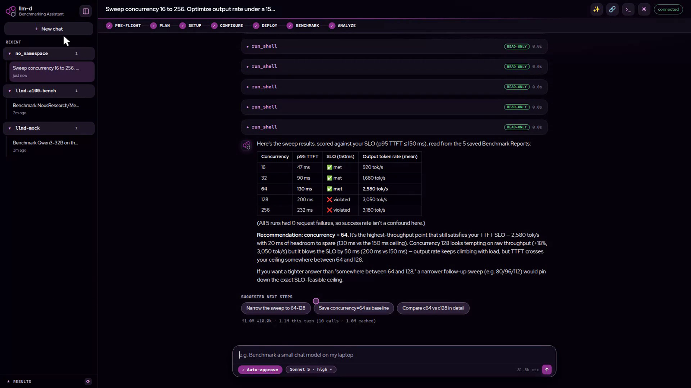

# llm-d Benchmarking Assistant

Benchmark [`llm-d`](https://github.com/llm-d/llm-d) by describing what you want in plain
English. No `llm-d-benchmark` expertise needed.

You say *"benchmark a chat app for ~500 concurrent users, p99 latency under 500 ms."* The
agent asks a couple of questions, checks your environment, shows you a plan, deploys an
`llm-d` stack if needed, runs the benchmark, and explains the results in plain words.
Nothing changes your system without your approval.

Licensed Apache-2.0.

## Demo

A 3-minute live session — the real agent plans, deploys, benchmarks, runs a sweep, and
explains the results. Click to watch:

[](llm-d-benchmarking-agent-project/docs/demo/llm-d-demo-live.mp4)

## Quick start

> **Proof of concept, laptop-first.** The tested path runs the assistant on a local
> [kind](https://kind.sigs.k8s.io/) cluster. A real remote/GPU cluster uses the same deploy
> but isn't tested yet — see
> [CLUSTER_SERVICE_DEPLOY.md](llm-d-benchmarking-agent-project/docs/guides/CLUSTER_SERVICE_DEPLOY.md).

One command builds the image, deploys to a local kind cluster, and opens the chat UI:

```bash
bash <(curl -fsSL https://raw.githubusercontent.com/TalBenAmii/llm-d-benchmarking-agent/main/install.sh)
```

It auto-installs missing prerequisites (docker/kind/kubectl/helm, asks for `sudo`) and
offers to wire your Claude subscription so chat works. Useful flags: `--no-open`,
`--no-build`, `--cluster NAME` (`./install.sh --help` lists the rest). Tear down with
`kind delete cluster --name bench-agent`.

**No cluster?** Run it straight on your host instead:

```bash
bash <(curl -fsSL https://raw.githubusercontent.com/TalBenAmii/llm-d-benchmarking-agent/main/llm-d-benchmarking-agent-project/scripts/install/install_local.sh)
cd ~/llm-d-benchmarking-agent/llm-d-benchmarking-agent-project && ./scripts/run.sh --open
```

**Give it an LLM.** Easiest: your Claude Pro/Max plan — no API key; both installers offer
to set it up. Or set `LLM_PROVIDER=anthropic` + `ANTHROPIC_API_KEY=...` (or any
OpenAI-compatible endpoint) in `.env`. To try the whole workflow without touching a
cluster, set `SIMULATE=1`: read-only commands run for real, mutations are announced but
no-opped.

## Use it from Claude Code (MCP)

Prefer the CLI over the web UI? [`llm-d-bench-mcp`](https://github.com/TalBenAmii/llm-d-bench-mcp)
exposes the same tools and knowledge as an MCP server. One command installs and registers it
(the local installer above already does this by default):

```bash
bash <(curl -fsSL https://raw.githubusercontent.com/TalBenAmii/llm-d-bench-mcp/main/scripts/install.sh)
```

No API key needed — it authenticates through your `claude` CLI login.

## How a session goes

1. **Interview** — it asks 2–3 questions to pin down your use case and SLOs.
2. **Probe** — read-only checks of your environment run automatically.
3. **Plan** — you get a plan card with the exact steps, plus a capacity pre-flight. You approve.
4. **Run** — deploy → smoketest → benchmark, output streaming live. Every mutating command
   waits for your click.
5. **Explain** — it reads the validated report and answers in plain words: *"median TTFT
   180 ms, p99 320 ms — under your 400 ms target."*
6. **Teardown** — it offers to clean everything up.

Beyond single runs it can compare runs and harnesses, sweep configs to find the best one for
your SLOs, track trends across sessions, check "will this model fit my GPU?", export
shareable HTML reports and reproducible provenance bundles, and orchestrate runs as
Kubernetes Jobs. The full, evidence-backed list is
[FEATURES.md](llm-d-benchmarking-agent-project/docs/reference/FEATURES.md).

## How it stays safe

- **Deny-by-default command policy** — the agent's command tools can only run an explicit
  allowlist ([command_policy.yaml](llm-d-benchmarking-agent-project/security/command_policy.yaml)).
- **Per-action approval** — read-only commands auto-run; every mutating or unknown command
  shows you the exact command and waits for Approve/Reject. Everything appears in the chat.
- **Secrets stay server-side** — keys live in the backend `.env`; the browser never sees
  them, and child-process env is scrubbed.
- **No invented numbers** — results come only from the schema-validated Benchmark Report;
  if a report is missing or invalid, it says so.

## Under the hood

**Thin code, thick agent.** The Python is only mechanism (chat UI, agent loop, tools,
command policy, schema validation). All benchmarking judgment lives in the LLM plus
editable Markdown/YAML files under
[`knowledge/`](llm-d-benchmarking-agent-project/knowledge/) — edit those to change the
agent's behavior without touching code.

This repo is a monorepo — the project plus read-only upstream repos it reads at runtime:

```
llm-d-benchmarking-agent/
├── llm-d/                            # deployment guides (read-only upstream)
├── llm-d-benchmark/                  # the llmdbenchmark CLI (read-only upstream)
├── llm-d-skills/                     # upstream skills library (read-only)
├── llm-d-bench-mcp/                  # the MCP server (owned sibling, its own git repo)
└── llm-d-benchmarking-agent-project/ # the project: app code, knowledge, docs, tests
```

Verify it hermetically (no key, cluster, or Docker needed):

```bash
cd llm-d-benchmarking-agent-project
make validate     # replay every flow through the real agent loop, executing nothing
pytest tests/     # the full suite
```

## Docs

| Doc | For |
|---|---|
| [USER_GUIDE.md](llm-d-benchmarking-agent-project/docs/guides/USER_GUIDE.md) | Using the agent end-to-end |
| [GPU_CLUSTER_RUNBOOK.md](llm-d-benchmarking-agent-project/docs/guides/GPU_CLUSTER_RUNBOOK.md) | From CPU-sim to a real single-GPU cluster |
| [DEPLOYMENT.md](llm-d-benchmarking-agent-project/docs/guides/DEPLOYMENT.md) | Local and in-cluster deploy, config, secrets |
| [ARCHITECTURE.md](llm-d-benchmarking-agent-project/docs/reference/ARCHITECTURE.md) | Layers, determinism gates, trust boundaries |
| [FEATURES.md](llm-d-benchmarking-agent-project/docs/reference/FEATURES.md) | Everything it can do + how to verify each |

Full index: [docs/README.md](llm-d-benchmarking-agent-project/docs/README.md).
