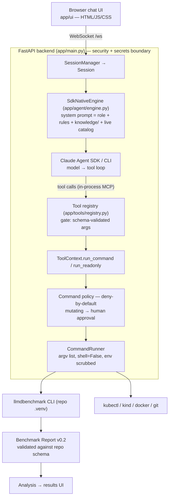

# Architecture

System-design reference for the llm-d Benchmarking Agent (what it is → the
[root README](../../../README.md)): the layers, data flow, trust boundaries, and the
invariants that keep the system safe and reliable.

## The two governing principles

Everything below follows from two rules (full statement → [`CLAUDE.md`](../../CLAUDE.md)):

1. **Thin code, thick agent.** Python is mechanism only; all judgment lives in the LLM plus
   editable Markdown/YAML under [`knowledge/`](../../knowledge/). No `if/elif` decision
   branches encoding benchmarking expertise in Python.
2. **Determinism via validation, not scripting.** The free-form LLM is constrained at the
   boundaries: schema-validated tool args, a catalog-cross-checked human-approved
   `SessionPlan`, structurally validated generated configs, and results parsed from the
   Benchmark Report v0.2 schema, never scraped from logs.

## High-level picture



<details>
<summary>ASCII version</summary>

```
                    Browser chat UI (app/ui/: HTML/JS/CSS)
                          │  WebSocket /ws
                          │  (assistant text · tool calls · streamed command output ·
                          │   approval cards · results · the executed-command trail)
                          ▼
   ┌──────────────────────────────────────────────────────────────────────┐
   │ FastAPI backend (app/main.py)  ── the security + secrets boundary      │
   │                                                                        │
   │   SessionManager ──► Session ──► SdkNativeEngine (app/agent/engine.py) │
   │                                      │                                 │
   │                       build_system_prompt = ROLE + HARD_RULES +        │
   │                       knowledge/*.md|*.yaml + LIVE catalog snapshot     │
   │                                      │                                 │
   │                                      ▼                                 │
   │                 Claude Agent SDK / CLI (runs the model→tool loop)      │
   │                                      │ tool calls via in-process MCP    │
   │                                      ▼                                 │
   │            tool registry (app/tools/registry.py)                       │
   │              dispatch: validate args (gate a) ─► handler                │
   │                                      │                                 │
   │                       ToolContext.run_command / run_readonly           │
   │                                      ▼                                 │
   │            policy.validate (deny-by-default)  ── gate ──► approval   │
   │                                      ▼                                 │
   │            CommandRunner: argv list, shell=False, env scrubbed         │
   └──────────────────────────────────────────────────────────────────────┘
                          │                         │
                          ▼                         ▼
              llmdbenchmark CLI (repo .venv)   kubectl / kind / docker / git
                          │
                          ▼
              Benchmark Report v0.2  ──► validate against the repo schema ──► summary
```

</details>

## Components (by layer)

### UI: `app/ui/`
A static, dependency-free chat client (`index.html`, `app.js`, `styles.css`) served by the
backend. It speaks the WebSocket event protocol (below), renders streamed command output,
shows Approve/Reject cards with the exact `argv`, exposes a Debug view of the full
executed-command trail, and provides a recent-chats sidebar and a results-browser/trends
view. It never sees an API key or a raw shell string.

### Backend: `app/`
FastAPI app (`app/main.py`). It is the trust boundary: the browser exchanges only chat
text, structured events, and Approve/Reject decisions. Responsibilities:

- **HTTP/WS surface**: see [`API.md`](API.md). `/` and `/static` serve the UI; `/ws` hosts
  the agent; `/healthz`, `/metrics`, `/api/sessions`, `/api/history*` are control/observe
  endpoints.
- **Lifespan wiring**: loads `Settings`, the `CommandPolicy`, the `CommandRunner`, the
  cross-session concurrency `Semaphore`, and the `SessionManager`; an unsupported
  `LLM_PROVIDER` is flagged at startup and surfaces as a clean per-turn error (never a crash).
- **Connection handling**: resume a saved chat via `/ws?session=<id>`; replay history and
  the command trail; keep an approved in-flight turn alive after a socket drop (background
  benchmark runs survive navigating away); reject a second connection's concurrent turn.

### Agent engine: `app/agent/`
- `engine.py`: `SdkNativeEngine`. The Claude Agent SDK/CLI runs the model→tool→model loop
  natively (bounded by `MAX_TURNS`); the engine assembles the system prompt + options,
  bridges the SDK stream onto the app's WS events, gates every tool call (approvals), and
  persists the transcript mirror. Tools execute through the in-process MCP wrapper
  (`app/tools/mcp_server.py`) → `registry.dispatch()`, so one tool can never crash the
  turn; rejections and errors are returned to the model so it can replan.
- `prompt.py`: `build_system_prompt()` = a fixed `ROLE` + `HARD_RULES` + every file
  under `knowledge/` + a live catalog snapshot read from the repo on disk. This is where
  the "thick agent" lives: changing the agent's behavior means editing `knowledge/`, not code.
- `session.py`: `Session` (resumable, persisted to the workspace) + `SessionManager`
  (per-session isolated workspaces, the shared concurrency cap, recent-chats listing).
- `events.py`: the typed WebSocket event vocabulary.

### Tools: `app/tools/` (the agent's entire action surface)
`registry.py` maps each tool name to a Pydantic input model plus a handler.
`dispatch()` validates the LLM's arguments against the model (determinism gate a) and
returns validation errors to the model instead of raising, so it can self-correct.
`ToolContext` (`context.py`) bundles the shared dependencies (settings, command policy, runner,
per-session workspace, the approval/emit callbacks, the concurrency semaphore) and exposes
the single command seam `run_command` / `run_readonly` that every execution passes
through. The agent's tools and their schemas are catalogued in [`API.md`](API.md).

### Security: `app/security/` + `security/command_policy.yaml`
- `command_policy.yaml` is data: a deny-by-default policy that is the single source of truth
  for what may be executed. Widening the agent's powers is a reviewed edit here, never a
  code change.
- `policy.py` is a pure validator with no per-command knowledge: it checks
  `argv[0]` (known executable), `argv[1]` (allowed subcommand), every remaining token
  (allowed flag / constrained value / allowed positional), screens for shell metacharacters,
  cross-checks `spec`/`harness`/`workload` against the live catalog, and computes the
  effective mode (`read_only` auto-runs; `mutating` requires approval; flags like
  `--dry-run` downgrade a mutating command to a read-only preview).
- `runner.py` (`CommandRunner`) spawns the process as an argv list with `shell=False`
  (command injection is structurally impossible), with the cwd pinned to the right repo, the
  environment scrubbed of secrets, output streamed line by line, and the whole process
  lifecycle bounded by a deadline (SIGKILL the process group on timeout).

### Validation: `app/validation/`
- `report.py`: loads the Benchmark Report v0.2 JSON Schema from the repo at runtime
  and validates parsed reports (determinism gate d); treats the schema's known
  stale-vs-its-own-example `additionalProperties` violations as non-fatal deviations and
  hard-fails only on structural errors.
- `session_plan.py`: the `SessionPlan` model (determinism gate b), whose enum fields
  are cross-checked against the live catalog before the approval card is shown. Carries
  optional `SLOTargets`.
- `analysis.py`: pure math for the analyzer. SLO evaluation over the percentile ladder,
  goodput estimation, and Pareto/DoE frontier selection.

### Orchestrator: `app/orchestrator/` (the Kubernetes-native centerpiece)
Runs a benchmark as a managed Kubernetes Job rather than a blocking local subprocess:
- `kube.py`: `KubeClient` over the policy-allowed `kubectl` runner (`RealKubeClient`) plus a
  `FakeKubeClient` for hermetic tests. Deliberately not the Python client, to keep the
  deny-by-default + approval + env-scrub model.
- `job.py`: the Job manifest model (`backoffLimit: 0`, `activeDeadlineSeconds`, run-id
  labels, a non-breaking pod `securityContext`).
- `controller.py`: `BenchmarkOrchestrator`. `submit` (write manifest, then `kubectl apply`),
  poll-based `watch` to a terminal state (wall-clock bounded), `stream_logs`, cluster-only
  `reconstruct` from labels, `run_with_retries`, parallel `run_sweep` (concurrency-capped,
  per-treatment dead-letter), and `cleanup`.
- `faults.py`: facts-only fault classification. `timeout`, `oom`, `unschedulable`,
  `evicted`, `image_error`, `run_error` (priority-ordered). Transient faults (eviction)
  retry as fresh, distinct Jobs; deterministic faults dead-letter immediately. Remediation
  judgment lives in `knowledge/orchestrator.md`, not here.

### Analyzer & history: `app/validation/analysis.py`, `app/storage/`
The analyzer computes goodput, SLO verdicts, and the Pareto-optimal / SLO-feasible frontier
across a DoE sweep. `app/storage/history.py` is a cross-session result store (persist a
validated report's summary; list/get/trend across runs) backing both the `result_history`
tool and the UI trends view.

### Capacity: `app/capacity/` + `scripts/bridges/capacity_check.py`
A pre-flight that answers "will this fit?" before a ~10-minute standup fails opaquely with
OOM. It runs the benchmark repo's own capacity planner (which lives only in that repo's
venv) through a vetted, policy-allowed bridge script over a workspace-confined JSON request,
plus weights + activation + KV-cache arithmetic. Pure math and diagnostics in `planner.py`;
the verdict-interpretation judgment is in `knowledge/capacity.md`.

### Observability: `app/observability/` + `deploy/observability/`
A dependency-free metrics registry (`metrics.py`) with Prometheus text exposition, plus
the instrumentation hooks (metric defs + `record_*` helpers, also in `metrics.py`) wired
through `ToolContext` and the orchestrator so tool calls, commands, and orchestrated runs
are counted and timed. `GET /metrics` exposes them. A Grafana dashboard and Prometheus
scrape config ship under `deploy/observability/`. (Distinct from the `observe_run_metrics`
tool, which reads live cluster CPU/memory via `kubectl top`.)

### Packaging: `Dockerfile` + `deploy/` + `app/packaging/`
A hardened non-root image (read-only rootfs; only `/workspace` + `/tmp` writable) and a one-command
Helm chart that renders the Deployment + Service + ServiceAccount + a namespaced least-privilege
Role/RoleBinding granting exactly the `kubectl` verbs `RealKubeClient` uses. The installer also labels
the namespace with the Baseline Pod Security Standard, so a mistaken/crafted Job can't mount a
`hostPath` and escape onto the node. See [`DEPLOYMENT.md`](../guides/DEPLOYMENT.md),
[`CLUSTER_SERVICE_DEPLOY.md`](../guides/CLUSTER_SERVICE_DEPLOY.md) §Security model, and `knowledge/packaging.md`.

## The four determinism gates

| Gate | Where | Enforces |
|---|---|---|
| **a. Tool args** | `tools/registry.py` `dispatch()` | The LLM can only act through schema-validated tool calls; bad args return errors to the model. |
| **b. SessionPlan** | `validation/session_plan.py` + `tools/setup/plan.py` | A structured plan whose spec/harness/workload are checked against the live catalog (the workload must belong to *that* harness) and whose namespace is RFC1123. A **human checkpoint**, not a precondition — see below. |
| **c. Generated config** | `validation/doe.py` + `validate_structure()` in `tools/run/doe.py` | The DoE cross-product is pure (no benchmarking judgment); the emitted YAML is structurally validated against the repo's format. |
| **d. Result schema** | `validation/report.py` | Results are parsed from a validated Benchmark Report v0.2 object, never scraped from logs. |

**Not gates** — asked for by the prompt and the tool descriptions, but enforced by no code:
- **Config preview via the CLI's own `--dry-run`/`plan`.** `config_artifact.py` states outright that deep
  `--dry-run` validation is deferred. Older docs listed this as gate (c); they were wrong.
- **"Plan before mutation."** Nothing keys off `session.approved_plan`. What actually stops an unapproved
  mutation is the **per-command approval gate** (`tools/command_exec.py`, `tools/run/shell.py`), which is
  independent of whether a plan exists.

`app/validation/CLAUDE.md` is the single source of truth for this list.

## Request flow (one user turn)

1. The browser sends `user_message` over `/ws`.
2. `SdkNativeEngine.run_turn` builds the system prompt (role + hard rules + knowledge +
   live catalog) and opens/resumes the CLI conversation with every tool exposed as an
   in-process MCP tool.
3. The model streams `assistant_text` and emits tool calls; the SDK dispatches each into
   the MCP wrapper.
4. For each tool call, `dispatch` validates the arguments (gate a) and runs the handler.
5. A handler that runs a command goes through `ToolContext.run_command`, then
   `policy.validate`. Read-only commands auto-run and emit a `command` event; mutating
   commands emit an `approval_request` and block until the user clicks Approve (then the
   command is re-validated, as defense in depth, and run, emitting the `command` event for
   what truly ran).
6. Output streams back as `output` lines; the tool returns a structured result
   (`tool_result`), which is fed back into the model.
7. The model↔tool loop repeats inside the SDK until the model stops calling tools, then
   the engine emits `done`.

## Trust & data-flow boundaries

- **Browser ↔ backend:** only chat text, structured events, and approval decisions. No
  secrets, no raw commands, no shell strings.
- **Backend ↔ child processes:** argv lists with `shell=False`; the subprocess environment
  is scrubbed so the LLM API key and HF token never reach a child (the HF token is passed only
  when explicitly configured, for gated real-model deploys, not the kind sim).
- **Backend ↔ repos:** the `llm-d` and `llm-d-benchmark` repos are read-only. The agent
  may clone them if missing but never modifies them; their docs, catalog, and report
  schema are read live, never vendored.
- **Backend ↔ cluster (in-cluster deploy):** `kubectl` calls authenticate as the pod's
  least-privilege ServiceAccount: exactly the verbs `RealKubeClient` needs and nothing more.

## Concurrency & resilience

- A shared `asyncio.Semaphore` (`settings.max_concurrent_runs`, default 2) bounds concurrent
  mutating executions across all sessions; read-only probes are never capped.
- An approved in-flight turn is not cancelled on WS disconnect. It finishes server-side
  and its result is replayed from history on reconnect. Post-disconnect approvals auto-reject
  so a detached turn can't hang holding a slot; a per-session running-turn registry blocks a
  second connection from double-running one chat.
- The orchestrator is stateless: the cluster (Job labels) is the source of truth, so it
  can `reconstruct` and reconcile after a backend restart.

## Build & tooling

- **Python 3.11**, managed with [`uv`](https://docs.astral.sh/uv/): the committed `uv.lock`
  is the source of truth for the venv. Dev setup, from `llm-d-benchmarking-agent-project/`:
  `uv sync --extra dev`, then `cp .env.example .env` and
  `uv run uvicorn app.main:app --reload` (details → [`DEPLOYMENT.md`](../guides/DEPLOYMENT.md)).
- **pytest**: hermetic suite under `tests/`, bucketed by subsystem (`agent/` · `tools/` ·
  `orchestrator/` · `platform/`, plus golden-transcript replays in `tests/flows/`). Run
  `pytest tests/` (or `make validate` for the flow replays); layout + gotchas →
  [`tests/CLAUDE.md`](../../tests/CLAUDE.md).
- **ruff** (lint + import order) and **mypy** (type-check), configured in `pyproject.toml`;
  git hooks gate them on `main` (installed via `scripts/install/install-git-hooks.sh`).

## Where to go next

- Tool & HTTP/WS reference: [`API.md`](API.md)
- Deploying to Kubernetes: [`DEPLOYMENT.md`](../guides/DEPLOYMENT.md)
- Using the agent end-to-end: [`USER_GUIDE.md`](../guides/USER_GUIDE.md)
- Flow validation (does the agent run the right commands?): [`VALIDATION.md`](VALIDATION.md)
