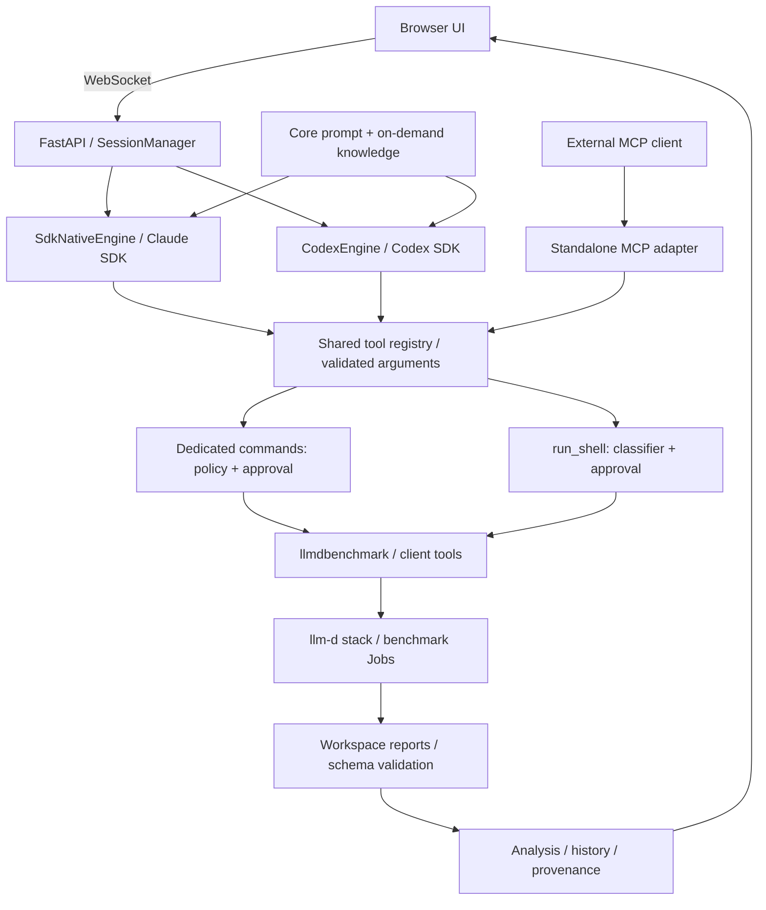

# Architecture

The assistant has two conversation engines (Claude and Codex), one shared tool layer,
a browser UI and a standalone MCP adapter. Python supplies execution and validation;
benchmarking guidance lives in the model and editable `knowledge/` files.

## High-level picture

[Open the full architecture diagram](architecture.html). It shows the in-cluster
service; local installation runs the same backend on the host. Codex subscription setup is
currently documented for that local path.

```mermaid
flowchart TB
    UI[Browser UI] -->|WebSocket| Session[FastAPI / SessionManager]
    Session --> Claude[SdkNativeEngine / Claude SDK]
    Session --> Codex[CodexEngine / Codex SDK]
    Client[External MCP client] --> MCP[Standalone MCP adapter]
    Knowledge[Core prompt + on-demand knowledge] --> Claude
    Knowledge --> Codex
    Claude --> Registry[Shared tool registry / validated arguments]
    Codex --> Registry
    MCP --> Registry
    Registry --> Dedicated[Dedicated commands: policy + approval]
    Registry --> Shell[run_shell: classifier + approval]
    Dedicated --> CLI[llmdbenchmark / client tools]
    Shell --> CLI
    CLI --> Cluster[llm-d stack / benchmark Jobs]
    Cluster --> Reports[Workspace reports / schema validation]
    Reports --> Analysis[Analysis / history / provenance]
    Analysis --> UI
```

The standalone MCP client owns its conversation and command permissions. It does not use
the application's browser session loop. Shared handlers and knowledge avoid duplicating
benchmark implementation between interfaces.

## Components (by layer)

Paths below are relative to `llm-d-benchmarking-agent-project/`, except named siblings.

| Files / directories | Responsibility and interactions |
|---|---|
| `app/main.py`, `app/ui/` | FastAPI HTTP/WebSocket service and static HTML/JS/CSS UI. Session events drive text, approval cards, debug output, charts and saved-chat navigation. No frontend compilation. |
| `app/agent/session.py`, `channel.py`, `events.py`, `ws_schemas.py` | Isolated session workspaces, persistence/resume, typed messages and approval responses. |
| `app/agent/engine.py`, `codex_engine.py` | Claude SDK and Codex SDK conversation bridges. Map provider events to the same application protocol and dispatch shared tools. |
| `app/agent/prompt.py`, `app/llm/`, `knowledge/` | Stable core system prompt, on-demand knowledge index, model/configuration adapters. Live catalog/environment context is supplied separately from the stable prefix. |
| `app/tools/registry.py`, `schemas/`, `mcp_server.py`, `context.py` | Pydantic tool contracts, validated dispatch, Claude in-process MCP wrapping and common execution/event dependencies. Codex uses its dynamic tool bridge. |
| `app/tools/setup/` | Environment/catalog probes, structured plans, capacity, configuration artifacts, guide conversion and stack discovery. |
| `app/tools/run/` | Dedicated CLI execution, shell execution, DoE, managed runs/sweeps and operation-grounding checks. |
| `app/tools/analyze/`, `access/` | Reports, comparisons, aggregation, history and provenance; knowledge/document access and next-step suggestions. |
| `app/security/`, `security/command_policy.yaml` | Dedicated-command validation; subprocess lifecycle, timeouts and environment scrubbing. The shell tool has a separate classifier. |
| `app/validation/` | SessionPlan/catalog consistency, generated config structure, upstream report schema validation, units and analysis math. |
| `app/orchestrator/` | Kubernetes Job manifests and kubectl adapter; submit/watch/logs, fault classification, retries, dead-letter failures, bounded sweeps and checkpoints. |
| `app/capacity/`, `app/readiness/` | Capacity arithmetic/planner bridge and endpoint/gateway readiness facts. |
| `app/storage/`, `app/packaging/` | History, provenance, share snapshots, retention and portable HTML exports. |
| `app/observability/`, `deploy/observability/` | Structured logs, correlation IDs, metrics, resource polling and Prometheus/Grafana assets. |
| `scripts/`, `deploy/`, `Dockerfile` | Install/run/evaluation helpers, benchmark-environment bridges, Helm/RBAC and container packaging. |
| `tests/`, `harnesses/` | Unit/integration tests, deterministic flow replay and opt-in live/cluster evaluation. |
| Sibling `llm-d-bench-mcp/llm_d_bench_mcp/` | stdio MCP server, per-connection ToolContext, resources, prompts and client approval adapters. |
| Siblings `llm-d/`, `llm-d-benchmark/`, `llm-d-skills/` | Read-only upstream guides, CLI/catalog/report schema, and workflow skills. Packaged at Dockerfile pins. |

## Request flow (one user turn)

1. The browser sends a message over `/ws`. The backend loads or creates a session and
   selects the configured engine (`LLM_PROVIDER`).
2. The engine supplies core knowledge and live context to its SDK conversation. Additional
   knowledge and upstream procedures are retrieved through tools.
3. The model calls a registered tool. Registry dispatch validates arguments and returns
   recoverable errors as tool results so the model can correct them.
4. Plan tools validate catalog references and request a human checkpoint. Dedicated command
   tools validate argv through the command policy; `run_shell` classifies a shell string.
   With Auto-approve off, mutating/unknown commands wait for a command-card decision.
5. Approved work executes locally through subprocesses or as orchestrated Kubernetes Jobs.
   Progress and structured results stream back to the UI and model.
6. Report parsing uses the live upstream schema. Analysis feeds result cards, comparisons,
   cross-session history and provenance exports. The model explains the evidence.

## The four determinism gates

| Gate | Location | Enforced boundary |
|---|---|---|
| Tool arguments | `tools/registry.py` | Pydantic input validation before handler dispatch. |
| SessionPlan | `validation/session_plan.py`, `tools/setup/plan.py` | Live catalog consistency, namespace structure and a plan approval checkpoint. |
| Generated config | `validation/doe.py`, `tools/run/doe.py` | Structural validation of generated experiment/config YAML. |
| Report | `validation/report.py` | Benchmark Report v0.2 structure; additional-field deviations may be tolerated, structural errors fail. |

Plan approval is not a universal precondition on every mutation. Dedicated benchmark
operations have additional skill-grounding checks; these are not a universal shell sandbox.
CLI `plan`/`--dry-run` is workflow guidance rather than an unavoidable deep-validation gate.

## Trust & data-flow boundaries

- **Dedicated command execution:** deny-by-default policy, argv lists and bounded child
  processes. Normal child environments scrub credentials.
- **Shell execution:** `run_shell` intentionally invokes `bash -lc`; a heuristic classifier
  decides whether approval is needed. It is not covered by the dedicated-command allowlist.
- **Approval modes:** read-only commands normally auto-run. Auto-approve can waive mutation
  cards. Standalone MCP relies on client tool permissions; plan elicitation falls back to
  accepting the inert plan when the client lacks elicitation support.
- **Provider adapters:** Codex disables inherited executable capabilities/MCP servers so
  application tool calls use the shared dispatch path. Authentication remains server-side.
- **Service exposure:** the application has no built-in multi-user authentication. Keep
  the local service bound to loopback or use separately secured access.
- **Storage:** sessions and results use the configured workspace. In the Helm deployment,
  the non-root service uses a read-only root filesystem with `/workspace` and `/tmp` writable.
  Kubernetes access is controlled by the chart's ServiceAccount and RBAC.
- **Upstreams:** agent operations read upstream source/catalog/schema and call its CLI.
  Installation builds separate virtual environments; it does not turn upstream source into
  owned project code.

## Results, concurrency & resilience

Reports supply measured metrics; missing metrics remain missing. Goodput is a
percentile-derived upper-bound estimate, not joint per-request SLO success. Cross-harness
comparisons require compatible workloads and units. `SIMULATE=1` uses synthetic results
for approved mutations while still running real read-only probes.

A shared semaphore bounds mutating executions. Approved in-flight work can finish after
WebSocket disconnect; approval requests can remain parked and reappear when the client
reconnects. Persisted transcripts support resume. Orchestrated Jobs carry run labels/deadlines and can be
reconstructed; sweeps use bounded concurrency and ConfigMap checkpoints. Transient faults
can retry as new Jobs while deterministic failures dead-letter. These mechanisms wrap
benchmark jobs; they do not implement a Kubernetes scheduler.

## Build & tooling

Use Python 3.11 and `uv sync --locked --extra dev`. Runtime dependencies include
FastAPI/Uvicorn, Pydantic/settings, JSON Schema, PyYAML, Claude Agent SDK and the pinned
Codex SDK. MCP adds MCP 1.x and AnyIO. Development uses pytest, Ruff and mypy. No Node build
is required for the UI. Real deployment adds the upstream benchmark CLI environment and
Docker/kind, kubectl, Helm/helmfile and the documented client utilities.

See [USER_GUIDE.md](../guides/USER_GUIDE.md) for installation,
[API.md](API.md) for protocols and [VALIDATION.md](VALIDATION.md) for flow replay.
